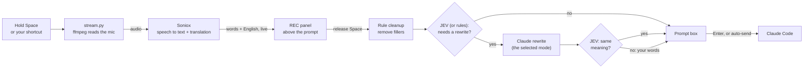

<div align="center">

# 🎙️ Persian Voice for Claude Code

### Speak Persian. Claude Code gets English.

<p dir="rtl">فارسی حرف بزنید، Claude Code پرامپت انگلیسی می‌گیرد.</p>

[](LICENSE)

[](https://code.claude.com/docs/en/plugins/mods/overview)

**Hold <kbd>Space</kbd> → say it in Persian, English, or both → release.**<br>
A clean English prompt is waiting in your prompt box.

</div>

```
╭──────────────────────────────────────────────────────────────╮
│ ● REC 0:07     ▁▂▅▇▅▃▂▁▂▃▅▆     release space to finish      │
│ تست‌ها رو اجرا کن و اونایی که خراب شدن رو درست کن             │
│ → Run the tests and fix the ones that fail                   │
╰──────────────────────────────────────────────────────────────╯
```

## You say it. Claude gets this.

| You say | Claude Code receives |
| --- | --- |
| تست‌ها رو اجرا کن و اونایی که خراب شدن رو درست کن | Run the tests and fix the ones that fail. |
| این `parseOrder` توی `auth.ts` وقتی order خالیه کرش می‌کنه، درستش کن | Fix the crash in `parseOrder` in `auth.ts` when the order is empty. |
| اممم… همون باگی که قبلاً گفتم رو درست کن | Fix the null check in `parseOrder` in `auth.ts`. *(in `chat` mode, it reads the conversation)* |

## Why

- **You think faster in your own language.** Say the idea the way it comes to you. Mix Persian and English as you do at work.
- **Claude works best in English.** The prompt arrives in English, so you get better answers than with Persian text.
- **No more Persian in the terminal.** No keyboard switching, no right-to-left text that jumps around, no Finglish.
- **Code names come out right.** It knows your project's files and names, so `auth.ts` and `parseOrder` are spelled correctly.
- **It cleans up after you.** "Um", "the the" and self-corrections go away. When you ramble, Claude rewrites it into a clear prompt, and never adds requests you did not say.

## Quick start (macOS, about 2 minutes)

**It is free. You need no account and no API key.** Speech recognition runs on your Mac with Whisper. You need [Claude Code](https://claude.com/claude-code), a Mac with Apple Silicon, Python 3.10+ and [Homebrew](https://brew.sh).

```sh
# 1. Get the mod and the free local speech engine
git clone https://github.com/Ariiima/claude-code-persian-to-english-voice.git ~/.claude/persian-voice
cd ~/.claude/persian-voice
python3 -m venv .venv && .venv/bin/pip install -r requirements-local.txt
brew install ffmpeg

# 2. Start Claude Code with the mod
claude --plugin-dir ~/.claude/persian-voice
```

In Claude Code, run `/voice off` once (the built-in dictation also uses <kbd>Space</kbd>), then run `/fa engine local`. Hold <kbd>Space</kbd> and talk. The first time, macOS asks for microphone access for your terminal. Allow it.

The first recording downloads a 1.6 GB model, so it takes a while. After that it works offline, and a short recording is read in about 1 second.

Want live text while you speak, or a faster first start? See the other [speech engines](#speech-engines).

To load the mod in every session, add it to `~/.claude/settings.json` (use your own home path):

```json
{ "env": { "CLAUDE_CODE_PLUGIN_DIRS": "/Users/YOU/.claude/persian-voice" } }
```

## Cheat sheet

| To do this | Do this |
| --- | --- |
| Record | Hold <kbd>Space</kbd>, speak, release |
| Record without holding | Tap <kbd>Space</kbd> 3 times, speak, tap once |
| Use your own shortcut | `/fa key ctrl+x v`, then press it to start and again to stop |
| Cancel a recording | Type any letter, or click **✕ Cancel** |
| Get back what you said | `/fa last` |
| Change the cleanup mode | `/fa mode`, or click **✨ mode** |
| Send as soon as you finish | `/fa send`, or click **⏎ send** |
| All settings | `/fa`, or click **⚙ Settings** |

A single tap of <kbd>Space</kbd> still types a space.

## Features

- **Live view.** A timer, a microphone level meter, your words and the English translation update while you speak.
- **Persian, English, or mixed.** Persian is translated. English stays as you said it.
- **Project-aware.** The project name, git branch and file names go to the speech recognizer.
- **Six cleanup modes.** From the plain translation (`exact`) to a full task spec (`spec`) or a git commit message (`commit`). See [Modes](#modes).
- **A prompt for each kind of task.** A bug fix, a feature, a refactor, tests, a review and a question each get the structure that the task needs.
- **Undo the rewrite.** A "Use plain translation" button stays for 20 seconds after a rewrite.
- **Learns your words.** When you correct a technical word before you send, the mod remembers it.
- **Your words are never lost.** Every recording is saved before any other step.
- **Optional auto-send,** with a safety stop for requests that cannot be undone (delete, force-push, deploy).
- **Free by default.** Whisper runs on your Mac: no key, no account, no internet. Google Gemini (free key) and Soniox (paid, live text) are options. See [Speech engines](#speech-engines).

## Speech engines

Change the engine with `/fa engine local`, `/fa engine google` or `/fa engine soniox`, or in `/fa` settings.

| Engine | Cost | Key | Live text | Internet | Status |
| --- | --- | --- | --- | --- | --- |
| **Local Whisper** (recommended) | Free | None | No, text appears after you release | Only for the first model download | Built in. Tested on Persian, English and mixed speech. |
| **Google Gemini** | Free key, no card: [aistudio.google.com/apikey](https://aistudio.google.com/apikey) | Yes | No, text appears after you release | Yes | Built in. Tested. Save the key in `~/.config/gemini/key`. |
| **Soniox** | Paid | Yes | Yes, with live English translation | Yes | Built in. Save the key in `~/.config/soniox/key`. |
| **Groq Whisper** | Free key, no card, with daily limits | Yes | No | Yes | Not built in yet. Groq did not answer from Iran when we tried, so we could not test it. |

Local Whisper and Gemini only transcribe. Claude makes the English draft from the transcript. In our test both read Persian with English code words well, and both can swap look-alike words (for example `parseOrder`). Add such words to your [word list](#your-word-list).

## Privacy

- **Audio** goes to Soniox (or to Google with `/fa engine google`) only while you record. With `/fa engine local`, audio never leaves your Mac. Recording stops by itself after 5 minutes.
- **Text** goes to Anthropic only when the rewrite runs, through your own Claude Code login.
- **Text for JEV** goes to TypeSafe only when you set a JEV key. It contains your words, their translation and the last 4 messages of the chat.
- **Your API keys** stay in `~/.config/…` or your environment. They are never written to the mod folder.

---

## Full guide

> **Mod, not plugin.** This is a [Claude Code mod](https://code.claude.com/docs/en/plugins/mods/overview): code that runs inside Claude Code and hooks into its events and interface. A plain plugin cannot catch the <kbd>Space</kbd> key or draw the live view.

<details>
<summary><b>Requirements</b></summary>

| What | Why |
| --- | --- |
| macOS | The microphone is read through AVFoundation. |
| Claude Code with plugin hooks (tested on v2.1.287) | The mod runs inside Claude Code. |
| Python 3.10 or later | Runs the audio stream (`stt/stream.py`). |
| [ffmpeg](https://ffmpeg.org) | Reads the microphone. |
| Apple Silicon Mac | Only for the local Whisper engine. Google and Soniox work on any Mac. |
| A speech engine | Local Whisper needs no key. Google needs a free [Gemini key](https://aistudio.google.com/apikey). Soniox needs a paid [Soniox](https://soniox.com) key. See [Speech engines](#speech-engines). |

The Google engine is `gemini-3.5-transcribe-live`. Soniox translates by itself.

</details>

<details>
<summary><b>Recording, tap mode and cancel</b></summary>

**Hold to talk**

1. Hold <kbd>Space</kbd>. The red **● REC** panel appears. This works on an empty prompt and in the middle of text.
2. Speak. Your words and the English translation update live.
3. Release <kbd>Space</kbd>. The text goes into the prompt box at the cursor.
4. Read the text, change it if necessary, and press <kbd>Enter</kbd>.

**Tap mode**

1. Tap <kbd>Space</kbd> 3 times quickly. The **● REC** panel shows "tap space to finish".
2. Speak.
3. Tap <kbd>Space</kbd> once. The text goes into the prompt box. With auto-send on, the mod sends it.

Tapped keys do not repeat, so the cursor does not move while you record.

**Cancel**

- Type any letter while a <kbd>Space</kbd> recording runs, or while the mod finishes or rewrites it. The letter does not type.
- Or click **✕ Cancel** in the REC panel. This works for every recording.

Nothing goes into the prompt box, and nothing is sent. `/fa last` still shows what you said.
<kbd>Esc</kbd> cannot cancel a recording: Claude Code does not pass the <kbd>Esc</kbd> key to mods.
You can also run `/fa rec` to start, and run `/fa rec` again, or press **⏹ Stop**, to finish.

</details>

<details>
<summary><b>Your own shortcut</b></summary>

You can use hold-Space, your own shortcut, or both.

1. Set a shortcut:

   ```text
   /fa key ctrl+x v
   ```

   The shortcut must have a modifier (`ctrl+r`, `meta+k`) or be a chord (`ctrl+x v`). A plain key would type a character.
   Choose a combination that Claude Code does not already use. The [keybindings docs](https://code.claude.com/docs/en/keybindings) list the defaults.

2. Press the shortcut to start. Press it again to stop. If you hold a shortcut that repeats, such as `meta+k`, the recording stops when you release it.

3. Optional: turn hold-Space off, so that <kbd>Space</kbd> only types:

   ```text
   /fa space off
   ```

To remove the shortcut, run `/fa key off`. This also turns hold-Space on again.
The shortcut is written to `~/.claude/keybindings.json`. Other bindings in the file are kept.

</details>

<details>
<summary><b>Settings dialog and commands</b></summary>

Type `/fa` (or click **⚙ Settings** above the prompt) to open the settings dialog:

```
How to start a recording
Hold Space         [ ● On  ]  hold Space to talk, release to finish
Shortcut           type one, e.g. ctrl+x v, then Enter

What happens to your words
Cleanup mode       Prompt ▾
                   Claude rewrites what you said into a clear prompt…
Auto-send          [ ○ Off ]  goes into the prompt box; you press Enter

Microphone and words
Microphone         System default ▾
Word list          12 words, 1 translation, 4 learned · ~/.config/persian-voice/terms.txt
```

Use <kbd>Tab</kbd> to move, <kbd>Enter</kbd> to change, and <kbd>Esc</kbd> to close. Changes are saved at once, for all projects.

| Command | What it does |
| --- | --- |
| `/fa` | Open the settings dialog. |
| `/fa rec` | Start or stop a recording without holding a key. |
| `/fa last` | Show your last recording (Persian and English) and put it in the prompt box again. |
| `/fa key [shortcut]` | Show or set your own shortcut, for example `/fa key ctrl+x v`. `/fa key off` removes it. |
| `/fa space [on\|off]` | Turn hold-Space to talk on or off. |
| `/fa mode [name]` | Show or set the cleanup mode. Without a name, it moves to the next mode. |
| `/fa polish` | Turn the cleanup on (`prompt`) or off (`exact`). |
| `/fa send` | Turn auto-send on or off. |
| `/fa mic` | List the microphones. `/fa mic 1` selects microphone 1. |
| `/fa terms` | Show your word list and the words the mod learned. |
| `/fa help` | Show all commands. |

With auto-send on, Claude Code shows the prompt as "The persian-voice plugin sent a message". Claude Code adds this label to every prompt that a plugin sends, and a mod cannot remove it. Claude still treats the text as your request.

</details>

### Modes

The mode sets what happens to your words after you stop speaking.

| Mode | Shown as | Result | Uses a model |
| --- | --- | --- | --- |
| `auto` | Auto | Like `prompt`, but JEV can also select a spec or a commit message. Without a JEV key, it works like `prompt`. | As the selected kind |
| `prompt` (default) | Prompt | A clear prompt in the form of the task: bug fix, feature, question, and others. | Only when needed (see below) |
| `chat` | Prompt (reads this chat) | Like `prompt`, but Claude also reads this conversation to replace "that bug" with the real name. Slower. | Yes |
| `spec` | Spec | A task spec with Goal, Context, Requirements and Done when. Good for thinking aloud. | Yes |
| `commit` | Commit msg | A git commit message. | Yes |
| `exact` | Exact | The translation only, with fillers removed. | No |

In `prompt` mode, Claude rewrites only when JEV finds a problem (and always for a story analysis). Without JEV, it rewrites only long or self-corrected requests.
The rewrite uses Claude Sonnet 5.5 at low effort, through your Claude Code login. If it takes more than 8 seconds or fails, you get the plain translation. In `chat` mode, after 8 seconds it falls back to the normal `prompt` mode.

<details>
<summary><b>Prompt kinds</b></summary>

Each type of task needs different information. For example, a bug fix needs the symptom, the location and what "fixed" looks like.
So the rewrite uses a different prompt for each type of task. With a JEV key, JEV selects the prompt for each recording. Without a key, the rewrite uses the general prompt.

| Kind | What the rewrite gives |
| --- | --- |
| General | The goal first, then the context, constraints and expected result. |
| Bug fix | The goal ("Fix …"), the symptom with the exact error message, when it occurs, where to look, and what "fixed" looks like. |
| Feature | The goal, where it goes and which pattern to follow, the requirements, the constraints, and how to check it. |
| Refactor | The goal, the scope, what must stay the same, and the target structure. |
| Tests | The code under test, the cases and edge cases, the constraints, and how to run the tests. |
| Review | What to review, what to look for, and the form of the report. |
| Question | Your question, which stays a question, with the exact code and sources it is about. |
| Story editor | The role "Act as an experienced fiction editor.", then the text, the aspects to analyze, and what to return. |
| Spec | A task spec with Goal, Context, Requirements, Out of scope and Done when. |
| Commit msg | A git commit message: an imperative subject of at most 72 characters. |

Each prompt includes only the parts that you said. The only addition is the role sentence of the story editor.
The prompts follow [Anthropic's prompting guidance](https://platform.claude.com/docs/en/build-with-claude/prompt-engineering/claude-prompting-best-practices) and the [Claude Code best practices](https://code.claude.com/docs/en/best-practices). They are in `hooks/prompts.ts`.

</details>

<details>
<summary><b>JEV checks (optional, smarter and faster)</b></summary>

[JEV](https://docs.typesafe.ai) is a fast decision model from TypeSafe. It does not write text. It answers yes/no and choice questions with probabilities, in about 1 second.
When you set a JEV key, the mod asks JEV these questions about each recording:

| Check | What the mod does |
| --- | --- |
| Does the text have fillers, a vague reference, rambling, or a translation error? | It runs the Claude rewrite only when the answer is yes. A clear request goes into the prompt box at once. |
| Does the recent chat make a vague reference clear ("fix that bug")? | It rewrites in the `chat` mode, so Claude replaces the reference with the real name. |
| Is the text a request for Claude? | When JEV is sure that it is not (for example, you talk to another person), the mod puts the text in the prompt box, but does not rewrite it or send it. |
| Does the request do something that you cannot undo (delete, force-push, deploy)? | With auto-send on, the mod does not send the prompt. It puts the text in the prompt box. Press <kbd>Enter</kbd> to send it. |
| Which kind of task is it? | It uses the rewrite prompt for that kind. |
| After the rewrite: did Claude add, change or remove something that you said? | It asks Claude for one more rewrite and tells it the problem. If the second rewrite also has a problem, it uses your own words. |

To turn on the checks, save your TypeSafe key:

```sh
mkdir -p ~/.config/typesafe
printf '%s' 'YOUR_JEV_API_KEY' > ~/.config/typesafe/key
chmod 600 ~/.config/typesafe/key
```

You can also set the `JEV_API_KEY` environment variable.
Without a key, or when JEV does not answer in 2.5 seconds, the mod uses its old rules. You do not lose a recording.

</details>

<details>
<summary><b>Your words are never lost</b></summary>

- The mod saves each recording before any other step. Run `/fa last` to see it again and to put it back in the prompt box.
- A long recording can end before Soniox finishes the translation. Then Claude translates your Persian words. If that fails, the Persian text goes into the prompt box.
- If the translation can miss your last words, the rewrite uses your Persian words to complete it.
- If an auto-sent prompt is not sent, it goes back into the prompt box.

</details>

<details>
<summary><b>How it works</b></summary>



1. The mod (`hooks/register.tsx`) watches the prompt box. A held key sends the same character many times. When spaces repeat fast, the mod starts a recording. A shortcut is a Claude Code keybinding that presses the mod's **Talk** button.
2. `stt/stream.py` reads the microphone with ffmpeg and sends the audio to Soniox. It prints the live text and the microphone level 6–7 times each second.
3. When you release the key, the mod tells `stream.py` to stop. Soniox then confirms the last words and their translation.
4. The mod cleans the text. With a JEV key, JEV decides if the text needs a rewrite. Without a key, simple rules decide.
5. If necessary, the mod asks Claude to rewrite the text. JEV then checks that the rewrite keeps your meaning.
6. The mod puts the text in the prompt box.

</details>

<details>
<summary><b>Configuration: word lists, saved settings, environment variables</b></summary>

**Your word list**

Add words that the recognizer gets wrong to `~/.config/persian-voice/terms.txt`. Write one word or name on each line.
To set a translation, write `persian = english`:

```text
# Names and terms
Kubernetes
useEffect
# Translations
دیپلوی = deploy
```

For words that belong to one project, create `.persian-voice-terms.txt` in the project folder. It has the same format. The mod reads it together with the global list, and only in that project. Commit the file to share it with your team.

The mod also adds the project name, the git branch and the project's file names by itself.

**Where settings are saved**

Your mode, auto-send, microphone, hold-Space and shortcut choices are saved in Claude Code's plugin store. They apply to all projects and sessions.

**Environment variables**

`stt/stream.py` reads these variables. The mod sets most of them for you.

| Variable | Meaning |
| --- | --- |
| `SONIOX_API_KEY` | The Soniox key. If it is not set, the key is read from `~/.config/soniox/key`. |
| `FA_ENGINE` | `soniox` (default), `google` or `local`. |
| `FA_LOCAL_MODEL` | The Whisper model for `local`. Default `mlx-community/whisper-large-v3-turbo`. `mlx-community/whisper-small-mlx` is faster but makes many mistakes in Persian. |
| `FA_LOCAL_LANG` | A language code for `local`, for example `fa`. Default: detect it. Forcing `fa` turned English-only speech into garbage in tests. |
| `GEMINI_API_KEY` | The Gemini key for `google`. If it is not set, the key is read from `~/.config/gemini/key`. |
| `FA_GEMINI_MODEL` | The Gemini model. Default `gemini-3.5-transcribe-live`. |
| `FA_GEMINI_LANGS` | BCP-47 codes to favour, comma separated. Default: `fa-IR`. It still reads English words and English-only speech. Empty means the model detects the language, which split `parseOrder` into "parse order" in tests. |
| `FA_MIC` | The microphone: an AVFoundation index, or `default`. |
| `FA_CONTEXT` | Project words for Soniox, as JSON. |
| `FA_STOP` | The file that tells the stream to finish. |
| `FA_INPUT` | An audio file to use instead of the microphone (for tests). |

</details>

<details>
<summary><b>Troubleshooting</b></summary>

| Problem | Solution |
| --- | --- |
| A warning says the built-in `/voice` is on | Run `/voice off` once. Each `/voice` command toggles it. |
| "Voice: nothing heard" | Check the microphone with `/fa mic`. Check that your terminal has microphone access in System Settings → Privacy & Security → Microphone. |
| "No key: set SONIOX_API_KEY …" | Save your key (step 2 of [Quick start](#quick-start-macos-about-2-minutes)). |
| Recording does not start | Start the recording on an empty prompt, or press <kbd>Space</kbd> twice quickly in text. Make sure `.venv` exists in the mod folder. |
| The cursor moves back and forth at the start of a hold | Claude Code draws each key before a mod can remove it. When a hold starts, the mod adds the chord `space space` to `~/.claude/keybindings.json`. Then Claude Code takes the held <kbd>Space</kbd> itself, and the cursor stops. Claude Code reads the changed file after about 2 seconds, so the first 2 seconds of a hold still flicker. The mod removes the chord when you release <kbd>Space</kbd>. To avoid the flicker completely, [use a shortcut](#cheat-sheet) and run `/fa space off`. |
| A key that you type right after a recording does not appear | After a hold, Claude Code can still wait for the second key of the `space space` chord for up to about 3 seconds, and it drops the next key. Wait until the text is in the prompt box, then type. |
| <kbd>Space</kbd> does not type in the prompt box | The `space space` chord stayed in `~/.claude/keybindings.json` (for example, after a crash). The mod removes it when a session starts. To remove it now, run `/reload-plugins`, or delete the `"space space"` line from the file. |
| The shortcut does nothing | Run `/fa key` to see it. Check that no other binding in `~/.claude/keybindings.json` uses the same keys. |
| "This does not look like a request for Claude" | JEV decided that you did not talk to Claude. Your text is in the prompt box. Press <kbd>Enter</kbd> to send it, or delete it. |
| "The translation did not finish" | The recording was long, and Soniox did not finish in time. Claude translated your words instead. Run `/fa last` to see the Persian text. |
| You cannot find what you said | Run `/fa last`. |
| "Not sent: this asks for something that cannot be undone" | JEV found a risky request while auto-send is on. Check the text in the prompt box, then press <kbd>Enter</kbd>. |

</details>

<details>
<summary><b>Development and prompt evals</b></summary>

```text
.claude-plugin/plugin.json   manifest
hooks/hooks.json             loads the hooks module
hooks/register.tsx           the mod: hold detection, live view, cleanup, commands
hooks/register.test.ts       tests
hooks/jev.ts                 the JEV questions
hooks/prompts.ts             the rewrite prompts, one for each kind of task
tools/jev_eval.py            scores the JEV questions on labelled examples (live API)
tools/rewrite_eval.py        runs the rewrite prompts through Claude and checks the results
tools/prompt_ab.py           compares the prompts of a commit with the current prompts
tools/prompt_ablation.py     removes one part of the prompts at a time and measures the loss
types/index.d.ts             types of the mod's shared state
stt/stream.py                microphone → speech engine (Soniox, Gemini or local Whisper)
requirements.txt             Python dependency
requirements-local.txt       extra dependency for the local Whisper engine
```

Run the checks from the mod folder. Claude Code writes the type definitions to `.claude-plugin/types/` when it loads the mod, so load it once before you type-check.

```sh
claude plugin validate .    # manifest and hooks
claude plugin test .        # tests
npx -p typescript tsc -p .  # type check
```

To test the stream without a microphone:

```sh
say -o /tmp/test.aiff "Run the tests"
FA_INPUT=/tmp/test.aiff .venv/bin/python stt/stream.py
```

It prints the live lines, then a last line with `"done": true` at the end of the file.

**Prompt evals**

To test a change to the JEV questions on labelled examples, run `python3 tools/jev_eval.py`.
To test a change to the rewrite prompts, run `python3 tools/rewrite_eval.py`. It runs one dictation of each kind through Claude, with the mod's retry, and checks the results. To compare effort levels, add `low`, `medium` or `high`. Both scripts need Node 22 or later.

| Script | What it does | Rewrites, cost at API prices |
|---|---|---|
| `tools/prompt_ab.py [git-ref] [repeats]` | Compares the prompts of a commit with the current prompts | 88 for 2 repeats, about $2 |
| `tools/prompt_ablation.py [repeats] [blocks\|rules]` | Removes one part of the prompts at a time and measures the loss | `blocks`: 276 for 2 repeats, about $6. `rules`: 828, about $17 |

Each rewrite costs about $0.02, because the `claude` CLI adds about 4,700 tokens of its own context to each call. With a Claude subscription, the calls count toward your plan's usage limit. Run the scripts with 1 repeat to halve the cost.

The last ablation test (`blocks`, 2 repeats) showed:

- **The rules block helps.** Without it, the mod passed 48 of 84 rewrites instead of 80 of 84. Uncertain ideas became requirements, corrections were lost, and Claude sometimes answered the request.
- **The task prompts for each kind help.** Without them, spec, commit and story rewrites failed (28 of 44 instead of 42 of 44).
- **Examples did not help** (82 of 84 without them), so the prompts have none.

</details>

---

<div align="center">

**If this saved you one keyboard switch, give it a ⭐ and send it to a Persian-speaking developer.**

[MIT](LICENSE)

</div>
