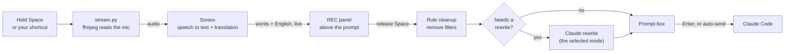

# Persian Voice for Claude Code

Hold <kbd>Space</kbd>, speak Persian (or English, or both), and release.
A clean English prompt appears in the Claude Code prompt box.

Persian Voice is a [Claude Code](https://claude.com/claude-code) plugin.
It streams your microphone to [Soniox](https://soniox.com) for live speech recognition and translation.
While you speak, you see your words and their English translation above the prompt.
When you release the key, the plugin can rewrite the text into a clear prompt with Claude.

```
╭──────────────────────────────────────────────────────────────╮
│ ● REC 0:07     ▁▂▅▇▅▃▂▁▂▃▅▆     release space to finish      │
│ تست‌ها رو اجرا کن و اونایی که خراب شدن رو درست کن             │
│ → Run the tests and fix the ones that fail                   │
╰──────────────────────────────────────────────────────────────╯
```

## Features

- **Hold to talk.** Hold <kbd>Space</kbd> to record. Release it to finish. This works on an empty prompt and in the middle of text.
- **Your own shortcut.** Do not want to hold Space? Set a shortcut such as <kbd>Ctrl</kbd>+<kbd>X</kbd> <kbd>V</kbd>: press it to start, press it again to stop. You can also turn hold-Space off.
- **Live view.** A timer, a microphone level meter, your words, and the English translation update while you speak.
- **Persian, English, or mixed.** Persian is translated to English. English stays as you said it.
- **Knows your project.** The project name, git branch and file names go to the speech recognizer. Names like `auth.ts` and `parseOrder` come out spelled correctly.
- **Clean prompts.** Fillers ("um", "the the") are removed at once. When the text needs more work, Claude rewrites it. You choose how (see [Modes](#modes)).
- **Undo the rewrite.** A "Use plain translation" button stays for 20 seconds after a rewrite.
- **Learns your words.** When you correct a technical word before you send, the plugin remembers it.
- **Optional auto-send.** The prompt can be sent as soon as you finish.

## Requirements

| What | Why |
| --- | --- |
| macOS | The microphone is read through AVFoundation. |
| Claude Code with plugin hooks (tested on v2.1.287) | The plugin runs inside Claude Code. |
| Python 3.10 or later | Runs the audio stream (`stt/stream.py`). |
| [ffmpeg](https://ffmpeg.org) | Reads the microphone. |
| A [Soniox](https://soniox.com) API key | Speech recognition and translation. |

## Install

1. Clone the repository:

   ```sh
   git clone https://github.com/Ariiima/claude-code-persian-voice.git ~/.claude/persian-voice
   cd ~/.claude/persian-voice
   ```

2. Install the Python dependency in a virtual environment. The plugin looks for `.venv` in this folder.

   ```sh
   python3 -m venv .venv
   .venv/bin/pip install -r requirements.txt
   ```

3. Install ffmpeg:

   ```sh
   brew install ffmpeg
   ```

4. Save your Soniox API key. Keep this file private.

   ```sh
   mkdir -p ~/.config/soniox
   printf '%s' 'YOUR_SONIOX_API_KEY' > ~/.config/soniox/key
   chmod 600 ~/.config/soniox/key
   ```

   You can also set the `SONIOX_API_KEY` environment variable instead.

5. Load the plugin in Claude Code. Choose one option:

   - **Every session:** add the folder to `~/.claude/settings.json`:

     ```json
     {
       "env": { "CLAUDE_CODE_PLUGIN_DIRS": "/Users/YOU/.claude/persian-voice" }
     }
     ```

   - **One session:** start Claude Code with `claude --plugin-dir ~/.claude/persian-voice`.

6. Turn off the built-in dictation, because it also uses <kbd>Space</kbd>. Run `/voice off` once in Claude Code.

7. The first time you record, macOS asks for microphone access for your terminal. Allow it.

## Use

### Record

1. Hold <kbd>Space</kbd>. The red **● REC** panel appears.
2. Speak. Your words and the English translation update live.
3. Release <kbd>Space</kbd>. The text goes into the prompt box at the cursor.
4. Read the text, change it if necessary, and press <kbd>Enter</kbd>.

A single tap of <kbd>Space</kbd> still types a space.
To record without holding a key, run `/fa`. Then run `/fa` again, or press **⏹ Stop**, to finish.

### Choose how to start a recording

You can use hold-Space, your own shortcut, or both.

1. Set a shortcut:

   ```text
   /fa key ctrl+x v
   ```

   The shortcut must have a modifier (`ctrl+r`, `meta+k`) or be a chord (`ctrl+x v`). A plain key would type a character.
   Choose a combination that Claude Code does not already use. The [keybindings docs](https://code.claude.com/docs/en/keybindings) list the defaults.

2. Press the shortcut to start. Press it again to stop. If you hold a shortcut that repeats, such as `meta+k`, the recording stops when you release it.

3. Optional: turn hold-Space off, so that <kbd>Space</kbd> only types:

   ```text
   /fa space off
   ```

To remove the shortcut, run `/fa key off`. This also turns hold-Space on again.

The shortcut is written to `~/.claude/keybindings.json`. Other bindings in the file are kept.

### Commands

| Command | What it does |
| --- | --- |
| `/fa` | Start or stop a recording without holding a key. |
| `/fa key [shortcut]` | Show or set your own shortcut, for example `/fa key ctrl+x v`. `/fa key off` removes it. |
| `/fa space [on\|off]` | Turn hold-Space to talk on or off. |
| `/fa mode [name]` | Show or set the cleanup mode. Without a name, it moves to the next mode. |
| `/fa polish` | Turn the cleanup on (`prompt`) or off (`exact`). |
| `/fa send` | Turn auto-send on or off. |
| `/fa mic` | List the microphones. `/fa mic 1` selects microphone 1. |
| `/fa terms` | Show your word list and the words the plugin learned. |
| `/fa help` | Show all commands. |

You can also click the **✨ mode** and **⏎ send** buttons above the prompt.

With auto-send on, Claude Code shows the prompt as "The persian-voice plugin sent a message". Claude Code adds this label to every prompt that a plugin sends, and a plugin cannot remove it. Claude still treats the text as your request.

### Modes

| Mode | Result | Uses a model |
| --- | --- | --- |
| `prompt` (default) | A clear prompt: the goal first, then the details you gave. | Only for long or self-corrected requests |
| `chat` | Like `prompt`, and uses the conversation to make "that bug" or "the file we changed" exact. Slower. | Yes (the session's model) |
| `spec` | A task spec with Goal, Context, Requirements and Done when. Good for thinking aloud. | Yes |
| `commit` | A git commit message. | Yes |
| `exact` | The translation only, with fillers removed. | No |

The rewrite uses Claude Sonnet 5.5 at low effort, through your Claude Code login.
If the rewrite takes more than 8 seconds or fails, the plain translation is used.
The rewrite never adds requirements that you did not say.

## How it works



1. The plugin (`hooks/register.tsx`) watches the prompt box. A held key sends the same character many times. When spaces repeat fast, the plugin starts a recording. A shortcut is a Claude Code keybinding that presses the plugin's **Talk** button.
2. `stt/stream.py` reads the microphone with ffmpeg and sends the audio to Soniox. It prints the live text and the microphone level 6–7 times each second.
3. When you release the key, the plugin tells `stream.py` to stop. Soniox then confirms the last words and their translation.
4. The plugin cleans the text and, if necessary, asks Claude to rewrite it. Then it puts the text in the prompt box.

## Configuration

### Your word list

Add words that the recognizer gets wrong to `~/.config/persian-voice/terms.txt`. Write one word or name on each line.
To set a translation, write `persian = english`:

```text
# Names and terms
Kubernetes
useEffect
# Translations
دیپلوی = deploy
```

The plugin also adds the project name, the git branch and the project's file names by itself.

### Settings

Your mode, auto-send, microphone, hold-Space and shortcut choices are saved in Claude Code's plugin store. They apply to all projects and sessions.

### Environment variables

`stt/stream.py` reads these variables. The plugin sets most of them for you.

| Variable | Meaning |
| --- | --- |
| `SONIOX_API_KEY` | The Soniox key. If it is not set, the key is read from `~/.config/soniox/key`. |
| `FA_MIC` | The microphone: an AVFoundation index, or `default`. |
| `FA_CONTEXT` | Project words for Soniox, as JSON. |
| `FA_STOP` | The file that tells the stream to finish. |
| `FA_INPUT` | An audio file to use instead of the microphone (for tests). |

## Privacy

- **Audio** goes to Soniox for recognition and translation. Recording runs only while you hold <kbd>Space</kbd>, or between two `/fa` commands. It stops by itself after 5 minutes.
- **Text** goes to Anthropic only when the rewrite runs. It uses your own Claude Code login.
- **Your API key** stays in `~/.config/soniox/key` or in your environment. It is never written to this folder.

## Troubleshooting

| Problem | Solution |
| --- | --- |
| A warning says the built-in `/voice` is on | Run `/voice off` once. Each `/voice` command toggles it. |
| "Voice: nothing heard" | Check the microphone with `/fa mic`. Check that your terminal has microphone access in System Settings → Privacy & Security → Microphone. |
| "No key: set SONIOX_API_KEY …" | Do step 4 of [Install](#install). |
| Recording does not start | Start the recording on an empty prompt, or press <kbd>Space</kbd> twice quickly in text. Make sure `.venv` exists in the plugin folder. |
| The cursor moves back and forth while you hold <kbd>Space</kbd> | This is a known limitation of hold-Space. Claude Code draws each key before a plugin can remove it. It occurs only while you record. To avoid it, [use a shortcut](#choose-how-to-start-a-recording) and run `/fa space off`. |
| The shortcut does nothing | Run `/fa key` to see it. Check that no other binding in `~/.claude/keybindings.json` uses the same keys. |

## Development

```text
.claude-plugin/plugin.json   plugin manifest
hooks/hooks.json             loads the hooks module
hooks/register.tsx           the plugin: hold detection, live view, cleanup, commands
hooks/register.test.ts       tests
types/index.d.ts             types of the plugin's shared state
stt/stream.py                microphone → Soniox stream
requirements.txt             Python dependency
```

Run the checks from the plugin folder. Claude Code writes the type definitions to `.claude-plugin/types/` when it loads the plugin, so load it once before you type-check.

```sh
claude plugin validate .    # manifest and hooks
claude plugin test .        # tests
npx -p typescript tsc -p .  # type check
```

To test the stream without a microphone:

```sh
say -o /tmp/test.aiff "Run the tests"
FA_INPUT=/tmp/test.aiff .venv/bin/python stt/stream.py
```

It prints the live lines, then a last line with `"done": true` at the end of the file.

## License

[MIT](LICENSE)
