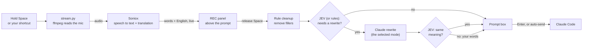

# Persian Voice for Claude Code

Hold <kbd>Space</kbd>, speak Persian (or English, or both), and release.
A clean English prompt appears in the Claude Code prompt box.

> **This is a mod, not a plugin.** It is a [Claude Code mod](https://code.claude.com/docs/en/plugins/mods/overview): code that runs inside Claude Code and hooks into its events and interface. A plain plugin cannot catch the Space key or draw the live view.

Persian Voice is a [Claude Code](https://claude.com/claude-code) mod.
It streams your microphone to [Soniox](https://soniox.com) for live speech recognition and translation.
The prompt arrives in English, so the model understands it better and gives a better answer than it does for Persian alone.
While you speak, you see your words and their English translation above the prompt.
When you release the key, you can improve the text: Claude rewrites it into a clear prompt. This is optional, and you choose how (see [Modes](#modes)).

```
╭──────────────────────────────────────────────────────────────╮
│ ● REC 0:07     ▁▂▅▇▅▃▂▁▂▃▅▆     release space to finish      │
│ تست‌ها رو اجرا کن و اونایی که خراب شدن رو درست کن             │
│ → Run the tests and fix the ones that fail                   │
╰──────────────────────────────────────────────────────────────╯
```

## Features

- **Hold to talk.** Hold <kbd>Space</kbd> to record. Release it to finish. This works on an empty prompt and in the middle of text.
- **Your own shortcut.** Do not want to hold Space? Set a shortcut such as <kbd>Ctrl</kbd>+<kbd>X</kbd> <kbd>V</kbd>: press it to start, press it again to stop. You can also turn hold-Space off.
- **Live view.** A timer, a microphone level meter, your words, and the English translation update while you speak.
- **Persian, English, or mixed.** Persian is translated to English. English stays as you said it.
- **Knows your project.** The project name, git branch and file names go to the speech recognizer. Names like `auth.ts` and `parseOrder` come out spelled correctly.
- **Clean prompts.** Fillers ("um", "the the") are removed at once. When the text needs more work, Claude rewrites it. You choose how (see [Modes](#modes)).
- **Undo the rewrite.** A "Use plain translation" button stays for 20 seconds after a rewrite.
- **Learns your words.** When you correct a technical word before you send, the plugin remembers it.
- **Optional auto-send.** The prompt can be sent as soon as you finish.

## Requirements

| What | Why |
| --- | --- |
| macOS | The microphone is read through AVFoundation. |
| Claude Code with plugin hooks (tested on v2.1.287) | The plugin runs inside Claude Code. |
| Python 3.10 or later | Runs the audio stream (`stt/stream.py`). |
| [ffmpeg](https://ffmpeg.org) | Reads the microphone. |
| A [Soniox](https://soniox.com) API key | Speech recognition and translation. |

## Install

1. Clone the repository:

   ```sh
   git clone https://github.com/Ariiima/claude-code-persian-to-english-voice.git ~/.claude/persian-voice
   cd ~/.claude/persian-voice
   ```

2. Install the Python dependency in a virtual environment. The plugin looks for `.venv` in this folder.

   ```sh
   python3 -m venv .venv
   .venv/bin/pip install -r requirements.txt
   ```

3. Install ffmpeg:

   ```sh
   brew install ffmpeg
   ```

4. Save your Soniox API key. Keep this file private.

   ```sh
   mkdir -p ~/.config/soniox
   printf '%s' 'YOUR_SONIOX_API_KEY' > ~/.config/soniox/key
   chmod 600 ~/.config/soniox/key
   ```

   You can also set the `SONIOX_API_KEY` environment variable instead.

5. Load the plugin in Claude Code. Choose one option:

   - **Every session:** add the folder to `~/.claude/settings.json`:

     ```json
     {
       "env": { "CLAUDE_CODE_PLUGIN_DIRS": "/Users/YOU/.claude/persian-voice" }
     }
     ```

   - **One session:** start Claude Code with `claude --plugin-dir ~/.claude/persian-voice`.

6. Turn off the built-in dictation, because it also uses <kbd>Space</kbd>. Run `/voice off` once in Claude Code.

7. The first time you record, macOS asks for microphone access for your terminal. Allow it.

## Use

### Record

1. Hold <kbd>Space</kbd>. The red **● REC** panel appears.
2. Speak. Your words and the English translation update live.
3. Release <kbd>Space</kbd>. The text goes into the prompt box at the cursor.
4. Read the text, change it if necessary, and press <kbd>Enter</kbd>.

A single tap of <kbd>Space</kbd> still types a space.

To record without holding a key:

1. Tap <kbd>Space</kbd> 3 times quickly. The **● REC** panel appears and shows "tap space to finish".
2. Speak.
3. Tap <kbd>Space</kbd> once. The text goes into the prompt box. With auto-send on, the plugin sends it.

Tapped keys do not repeat, so the cursor does not move while you record.

To cancel a recording, for example when the translation is wrong:

- Type any letter while a <kbd>Space</kbd> recording runs, or while the plugin finishes or rewrites it. The letter does not type.
- Or click **✕ Cancel** in the REC panel. This works for every recording.

Nothing goes into the prompt box, and nothing is sent. You can start a new recording at once. `/fa last` still shows what you said.
<kbd>Esc</kbd> cannot cancel a recording: Claude Code does not pass the <kbd>Esc</kbd> key to plugins.
You can also run `/fa rec` to start, and run `/fa rec` again, or press **⏹ Stop**, to finish.

### Settings

Type `/fa` (or click **⚙ Settings** above the prompt) to open the settings dialog. It shows every setting and its current value, and you change them in place:

```
How to start a recording
Hold Space         [ ● On  ]  hold Space to talk, release to finish
Shortcut           type one, e.g. ctrl+x v, then Enter

What happens to your words
Cleanup mode       Prompt ▾
                   Claude rewrites what you said into a clear prompt…
Auto-send          [ ○ Off ]  goes into the prompt box; you press Enter

Microphone and words
Microphone         System default ▾
Word list          12 words, 1 translation, 4 learned · ~/.config/persian-voice/terms.txt
```

Use <kbd>Tab</kbd> to move, <kbd>Enter</kbd> to change, and <kbd>Esc</kbd> to close. Changes are saved at once, for all projects.

### Choose how to start a recording

You can use hold-Space, your own shortcut, or both.

1. Set a shortcut:

   ```text
   /fa key ctrl+x v
   ```

   The shortcut must have a modifier (`ctrl+r`, `meta+k`) or be a chord (`ctrl+x v`). A plain key would type a character.
   Choose a combination that Claude Code does not already use. The [keybindings docs](https://code.claude.com/docs/en/keybindings) list the defaults.

2. Press the shortcut to start. Press it again to stop. If you hold a shortcut that repeats, such as `meta+k`, the recording stops when you release it.

3. Optional: turn hold-Space off, so that <kbd>Space</kbd> only types:

   ```text
   /fa space off
   ```

To remove the shortcut, run `/fa key off`. This also turns hold-Space on again.

The shortcut is written to `~/.claude/keybindings.json`. Other bindings in the file are kept.

### Commands

| Command | What it does |
| --- | --- |
| `/fa` | Open the [settings](#settings) dialog. |
| `/fa rec` | Start or stop a recording without holding a key. |
| `/fa last` | Show your last recording (Persian and English) and put it in the prompt box again. |
| `/fa key [shortcut]` | Show or set your own shortcut, for example `/fa key ctrl+x v`. `/fa key off` removes it. |
| `/fa space [on\|off]` | Turn hold-Space to talk on or off. |
| `/fa mode [name]` | Show or set the cleanup mode. Without a name, it moves to the next mode. |
| `/fa polish` | Turn the cleanup on (`prompt`) or off (`exact`). |
| `/fa send` | Turn auto-send on or off. |
| `/fa mic` | List the microphones. `/fa mic 1` selects microphone 1. |
| `/fa terms` | Show your word list and the words the plugin learned. |
| `/fa help` | Show all commands. |

You can also click the **✨ mode**, **⏎ send** and **⚙ Settings** buttons above the prompt.

With auto-send on, Claude Code shows the prompt as "The persian-voice plugin sent a message". Claude Code adds this label to every prompt that a plugin sends, and a plugin cannot remove it. Claude still treats the text as your request.

### Modes

The mode sets what happens to your words after you stop speaking.

| Mode | Shown as | Result | Uses a model |
| --- | --- | --- | --- |
| `auto` | Auto | Like `prompt`, but JEV can also select a spec or a commit message (see [Prompt kinds](#prompt-kinds)). Without a JEV key, it works like `prompt`. | As the selected kind |
| `prompt` (default) | Prompt | A clear prompt in the form of the task that JEV detects: bug fix, feature, question, story analysis, and others (see [Prompt kinds](#prompt-kinds)). | Only when JEV finds a problem, and always for a story analysis. Without JEV: only for long or self-corrected requests |
| `chat` | Prompt (reads this chat) | Like `prompt`, but Claude also reads this conversation (see below). Slower. | Yes (the session's model) |
| `spec` | Spec | A task spec with Goal, Context, Requirements and Done when. Good for thinking aloud. | Yes |
| `commit` | Commit msg | A git commit message. | Yes |
| `exact` | Exact | The translation only, with fillers removed. | No |

#### What "Prompt (reads this chat)" does

When you speak, you often refer to things from the conversation: "fix that bug", "undo the change in the file we edited".
The normal `prompt` mode sees only your words, so these references stay vague.
The `chat` mode also gives Claude the conversation so far. Claude uses it only to replace a vague reference with the real name. It does not add new requests.

| You say | `prompt` gives | `chat` gives |
| --- | --- | --- |
| "um, fix that bug from before" | Fix that bug from before. | Fix the null check in `parseOrder` in `auth.ts`. |

Use `chat` when you talk about earlier work. It is slower, because Claude reads the whole conversation. If it takes more than 8 seconds, the plugin uses the normal `prompt` mode instead.

The rewrite uses Claude Sonnet 5.5 at low effort, through your Claude Code login.
If the rewrite takes more than 8 seconds or fails, the plain translation is used.
The rewrite never adds requirements that you did not say.

#### Prompt kinds

Each type of task needs different information. For example, a bug fix needs the symptom, the location and what "fixed" looks like.
So the rewrite uses a different prompt for each type of task. With a JEV key, JEV selects the prompt for each recording. Without a key, the rewrite uses the general prompt.

| Kind | What the rewrite gives |
| --- | --- |
| General | The goal first, then the context, constraints and expected result. |
| Bug fix | The goal ("Fix …"), the symptom with the exact error message, when it occurs, where to look, and what "fixed" looks like. |
| Feature | The goal, where it goes and which pattern to follow, the requirements, the constraints, and how to check it. |
| Refactor | The goal, the scope, what must stay the same, and the target structure. |
| Tests | The code under test, the cases and edge cases, the constraints, and how to run the tests. |
| Review | What to review, what to look for, and the form of the report. |
| Question | Your question, which stays a question, with the exact code and sources it is about. |
| Story editor | The role "Act as an experienced fiction editor.", then the text, the aspects to analyze, and what to return. |
| Spec | A task spec with Goal, Context, Requirements, Out of scope and Done when. |
| Commit msg | A git commit message: an imperative subject of at most 72 characters. |

Each prompt includes only the parts that you said. The only addition is the role sentence of the story editor.
The prompts follow [Anthropic's prompting guidance](https://platform.claude.com/docs/en/build-with-claude/prompt-engineering/claude-prompting-best-practices) and the [Claude Code best practices](https://code.claude.com/docs/en/best-practices). They are in `hooks/prompts.ts`.

### JEV checks (optional)

[JEV](https://docs.typesafe.ai) is a fast decision model from TypeSafe. It does not write text. It answers yes/no and choice questions with probabilities, in about 1 second.
When you set a JEV key, the plugin asks JEV these questions about each recording:

| Check | What the plugin does |
| --- | --- |
| Does the text have fillers, a vague reference, rambling, or a translation error? | It runs the Claude rewrite only when the answer is yes. A clear request goes into the prompt box at once. |
| Does the recent chat make a vague reference clear ("fix that bug")? | It rewrites in the `chat` mode, so Claude replaces the reference with the real name. |
| Is the text a request for Claude? | When JEV is sure that it is not (for example, you talk to another person), the plugin puts the text in the prompt box, but does not rewrite it or send it. |
| Does the request do something that you cannot undo (delete, force-push, deploy)? | With auto-send on, the plugin does not send the prompt. It puts the text in the prompt box. Press <kbd>Enter</kbd> to send it. |
| Which kind of task is it? | It uses the rewrite prompt for that [kind](#prompt-kinds). |
| After the rewrite: did Claude add, change or remove something that you said? | It asks Claude for one more rewrite and tells it the problem. If the second rewrite also has a problem, it uses your own words. |

To turn on the checks, save your TypeSafe key:

```sh
mkdir -p ~/.config/typesafe
printf '%s' 'YOUR_JEV_API_KEY' > ~/.config/typesafe/key
chmod 600 ~/.config/typesafe/key
```

You can also set the `JEV_API_KEY` environment variable.
Without a key, or when JEV does not answer in 2.5 seconds, the plugin uses its old rules. You do not lose a recording.

The questions are in `hooks/jev.ts`. To test a change to them on labelled examples, run `python3 tools/jev_eval.py`.
To test a change to the rewrite prompts, run `python3 tools/rewrite_eval.py`. It runs one dictation of each kind through Claude, with the plugin's retry, and checks the results. To compare effort levels, add `low`, `medium` or `high`. The script shows the API time of each rewrite. Both scripts need Node 22 or later.

Two more scripts measure whether a change to the prompts helps:

| Script | What it does | Rewrites, cost at API prices |
|---|---|---|
| `tools/prompt_ab.py [git-ref] [repeats]` | Compares the prompts of a commit with the current prompts | 88 for 2 repeats, about $2 |
| `tools/prompt_ablation.py [repeats] [blocks\|rules]` | Removes one part of the prompts at a time and measures the loss | `blocks`: 276 for 2 repeats, about $6. `rules`: 828, about $17 |

Each rewrite costs about $0.02, because the `claude` CLI adds about 4,700 tokens of its own context to each call. With a Claude subscription, the calls count toward your plan's usage limit. Run the scripts with 1 repeat to halve the cost.

The last ablation test (`blocks`, 2 repeats) showed:

- **The rules block helps.** Without it, the plugin passed 48 of 84 rewrites instead of 80 of 84. Uncertain ideas became requirements, corrections were lost, and Claude sometimes answered the request.
- **The task prompts for each kind help.** Without them, spec, commit and story rewrites failed (28 of 44 instead of 42 of 44).
- **Examples did not help** (82 of 84 without them), so the prompts have none.

### Your words are never lost

The plugin keeps every recording:

- It saves each recording before any other step. Run `/fa last` to see it again and to put it back in the prompt box.
- A long recording can end before Soniox finishes the translation. Then Claude translates your Persian words. If that fails, the Persian text goes into the prompt box.
- If the translation can miss your last words, the rewrite uses your Persian words to complete it.
- If an auto-sent prompt is not sent, it goes back into the prompt box.

## How it works



1. The plugin (`hooks/register.tsx`) watches the prompt box. A held key sends the same character many times. When spaces repeat fast, the plugin starts a recording. A shortcut is a Claude Code keybinding that presses the plugin's **Talk** button.
2. `stt/stream.py` reads the microphone with ffmpeg and sends the audio to Soniox. It prints the live text and the microphone level 6–7 times each second.
3. When you release the key, the plugin tells `stream.py` to stop. Soniox then confirms the last words and their translation.
4. The plugin cleans the text. With a JEV key, JEV decides if the text needs a rewrite. Without a key, simple rules decide.
5. If necessary, the plugin asks Claude to rewrite the text. JEV then checks that the rewrite keeps your meaning.
6. The plugin puts the text in the prompt box.

## Configuration

### Your word list

Add words that the recognizer gets wrong to `~/.config/persian-voice/terms.txt`. Write one word or name on each line.
To set a translation, write `persian = english`:

```text
# Names and terms
Kubernetes
useEffect
# Translations
دیپلوی = deploy
```

The plugin also adds the project name, the git branch and the project's file names by itself.

### Where settings are saved

Your mode, auto-send, microphone, hold-Space and shortcut choices are saved in Claude Code's plugin store. They apply to all projects and sessions. To change them, use the [settings dialog](#settings).

### Environment variables

`stt/stream.py` reads these variables. The plugin sets most of them for you.

| Variable | Meaning |
| --- | --- |
| `SONIOX_API_KEY` | The Soniox key. If it is not set, the key is read from `~/.config/soniox/key`. |
| `FA_MIC` | The microphone: an AVFoundation index, or `default`. |
| `FA_CONTEXT` | Project words for Soniox, as JSON. |
| `FA_STOP` | The file that tells the stream to finish. |
| `FA_INPUT` | An audio file to use instead of the microphone (for tests). |

## Privacy

- **Audio** goes to Soniox for recognition and translation. Recording runs only while you hold <kbd>Space</kbd>, or between two presses of your shortcut or `/fa rec`. It stops by itself after 5 minutes.
- **Text** goes to Anthropic only when the rewrite runs. It uses your own Claude Code login.
- **Text for JEV** goes to TypeSafe only when you set a JEV key. It contains your words, their translation and the last 4 messages of the chat.
- **Your API keys** stay in `~/.config/soniox/key`, `~/.config/typesafe/key` or your environment. They are never written to this folder.

## Troubleshooting

| Problem | Solution |
| --- | --- |
| A warning says the built-in `/voice` is on | Run `/voice off` once. Each `/voice` command toggles it. |
| "Voice: nothing heard" | Check the microphone with `/fa mic`. Check that your terminal has microphone access in System Settings → Privacy & Security → Microphone. |
| "No key: set SONIOX_API_KEY …" | Do step 4 of [Install](#install). |
| Recording does not start | Start the recording on an empty prompt, or press <kbd>Space</kbd> twice quickly in text. Make sure `.venv` exists in the plugin folder. |
| The cursor moves back and forth at the start of a hold | Claude Code draws each key before a plugin can remove it. When a hold starts, the plugin adds the chord `space space` to `~/.claude/keybindings.json`. Then Claude Code takes the held <kbd>Space</kbd> itself, and the cursor stops. Claude Code reads the changed file after about 2 seconds, so the first 2 seconds of a hold still flicker. The plugin removes the chord when you release <kbd>Space</kbd>. To avoid the flicker completely, [use a shortcut](#choose-how-to-start-a-recording) and run `/fa space off`. |
| A key that you type right after a recording does not appear | After a hold, Claude Code can still wait for the second key of the `space space` chord for up to about 3 seconds, and it drops the next key. Wait until the text is in the prompt box, then type. |
| <kbd>Space</kbd> does not type in the prompt box | The `space space` chord stayed in `~/.claude/keybindings.json` (for example, after a crash). The plugin removes it when a session starts. To remove it now, run `/reload-plugins`, or delete the `"space space"` line from the file. |
| The shortcut does nothing | Run `/fa key` to see it. Check that no other binding in `~/.claude/keybindings.json` uses the same keys. |
| "This does not look like a request for Claude" | JEV decided that you did not talk to Claude. Your text is in the prompt box. Press <kbd>Enter</kbd> to send it, or delete it. |
| "The translation did not finish" | The recording was long, and Soniox did not finish in time. Claude translated your words instead. Run `/fa last` to see the Persian text. |
| You cannot find what you said | Run `/fa last`. |
| "Not sent: this asks for something that cannot be undone" | JEV found a risky request while auto-send is on. Check the text in the prompt box, then press <kbd>Enter</kbd>. |

## Development

```text
.claude-plugin/plugin.json   plugin manifest
hooks/hooks.json             loads the hooks module
hooks/register.tsx           the plugin: hold detection, live view, cleanup, commands
hooks/register.test.ts       tests
hooks/jev.ts                 the JEV questions
hooks/prompts.ts             the rewrite prompts, one for each kind of task
tools/jev_eval.py            scores the JEV questions on labelled examples (live API)
tools/rewrite_eval.py        runs the rewrite prompts through Claude and checks the results
tools/prompt_ab.py           compares the prompts of a commit with the current prompts
tools/prompt_ablation.py     removes one part of the prompts at a time and measures the loss
types/index.d.ts             types of the plugin's shared state
stt/stream.py                microphone → Soniox stream
requirements.txt             Python dependency
```

Run the checks from the plugin folder. Claude Code writes the type definitions to `.claude-plugin/types/` when it loads the plugin, so load it once before you type-check.

```sh
claude plugin validate .    # manifest and hooks
claude plugin test .        # tests
npx -p typescript tsc -p .  # type check
```

To test the stream without a microphone:

```sh
say -o /tmp/test.aiff "Run the tests"
FA_INPUT=/tmp/test.aiff .venv/bin/python stt/stream.py
```

It prints the live lines, then a last line with `"done": true` at the end of the file.

## License

[MIT](LICENSE)
